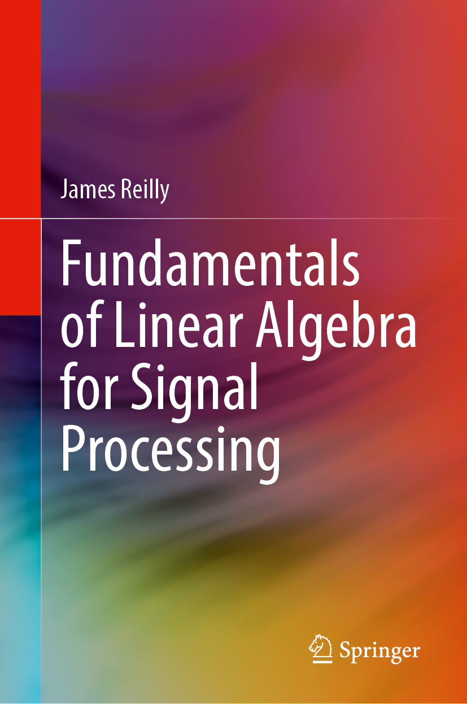

# Springer Nature Code Inside

This repository accompanies the book [*Fundamentals of Linear Algebra for Signal Processing*](https://doi.org/10.1007/978-3-031-68915-4) by James Reilly (Springer Cham, 2025).

